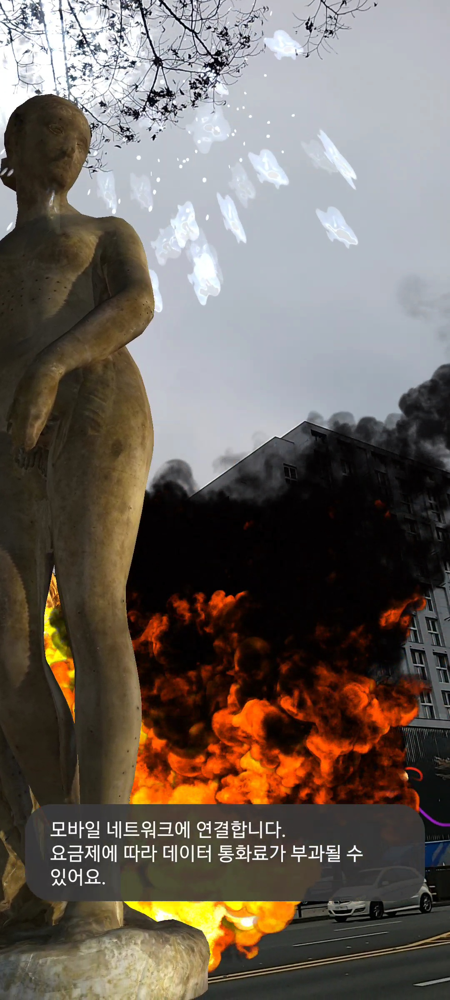

# AR Core & Firebase Demo
Plane Detection            |  Face Detection          |  Image Detection          |  Firebase                |  Geospatial
:-------------------------:|:------------------------:|:-------------------------:|:------------------------:|:-------------------------:|
      |    |     |    | 

## :memo: Table of Contents
- [What is this?](#what-is-this)
- [Part 1. Features](#features)
  - [Plane Detection](#plane-detection)
  - [Face Detection](#face-detection)
  - [Image Detection](#image-detection)
  - [Firebase Database](#firebase-database)
  - [Geospatial](#geospatial)

# :star: What is this?
AR Core & Firebase Demo 입니다.

# :star: Part 1. Features
## :bulb: Plane Detection [Link](https://github.com/henry2craftman/ARProject/Assets/MainFolder/PlaneDetection)
</img>
## :bulb: Face Detection [Link](https://github.com/henry2craftman/ARProject/Assets/MainFolder/FaceDetection)
</img>
## :bulb: Image Detection [Link](https://github.com/henry2craftman/ARProject/Assets/MainFolder/ImageDetection)
</img>
## :bulb: Firebase Database [Link](https://github.com/henry2craftman/ARProject/Assets/MainFolder/FirebaseDetection)
</img>
## :bulb: Geospatial [Link](https://github.com/henry2craftman/ARProject/Assets/MainFolder/Geospatial)
</img>
