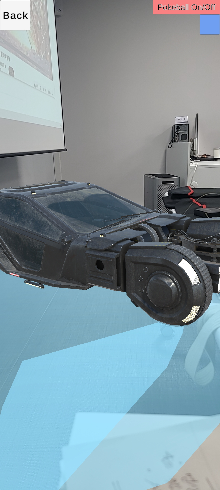
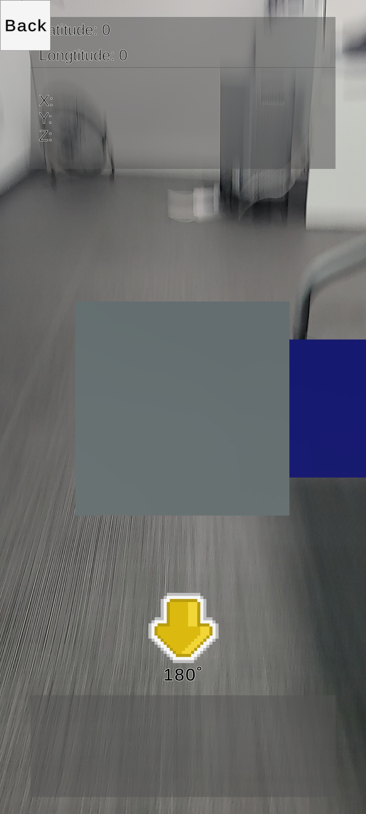
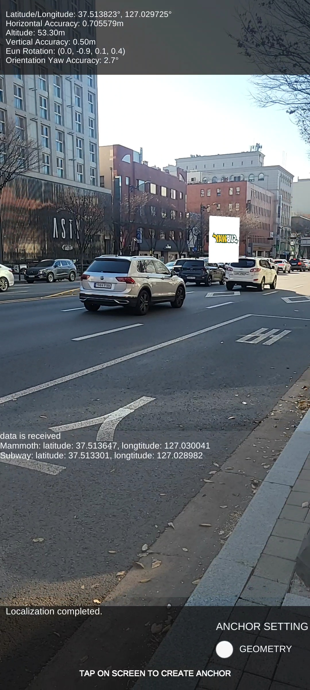

# AR Core & Firebase Demo
Plane Detection            |  Face Detection          |  Image Detection          |  Firebase                |  Geospatial
:-------------------------:|:------------------------:|:-------------------------:|:------------------------:|:-------------------------:|
      |    |     |    | 

<h2 id="table-of-contents">📝 Table of Contents</h2>

- [What is this?](#what-is-this)
- [Features](#features)
  - [Plane Detection](#plane-detection)
  - [Face Detection](#face-detection)
  - [Image Detection](#image-detection)
  - [Firebase Database](#firebase-database)
  - [Geospatial](#geospatial)

# :star: What is this?
AR Core & Firebase Demo 입니다.

# :star: Features
<h2 id="plane-detection"><a href="https://github.com/henry2craftman/ARProject/tree/main/Assets/MainFolder/PlaneDetection">💡 Plane Detection</a></h2>

<!--## :bulb: Plane Detection [Link](https://github.com/henry2craftman/ARProject/tree/main/Assets/MainFolder/PlaneDetection)-->
- AR Core의 AR Plane Manager를 사용하여 Plane을 감지하여 바닥에 Mesh 생성
- AR Raycast Manager를 사용하여 바닥에 3D Object(Cyberpunk car)를 설치
- 생성된 3D Object는 손가락 터치로 3D Object를 확대, 축소, 회전 가능
- 자세한 내용은 Link를 클릭해 주세요.
  
</img>

[목차로 돌아가기](#table-of-contents)

<h2 id="face-detection"><a href="https://github.com/henry2craftman/ARProject/tree/main/Assets/MainFolder/FaceDetection">💡 Face Detection</a></h2>

### Basic Face Detection
- AR Core의 AR Face Manager를 사용하여 전방 카메라의 얼굴을 감지, 얼굴의 중앙에 3D Object(Face Mask)를 생성
### Face Detection with Mesh
- AR Core의 AR Face Manager를 사용하여 전방 카메라의 얼굴을 감지, 얼굴의 모든 468개의 Facial features를 정점으로 갖는 Mesh 생성
- 생성된 얼굴 Mesh에 비디오를 재생
- 자세한 내용은 Link를 클릭해 주세요.

</img>

[목차로 돌아가기](#table-of-contents)

<h2 id="image-detection"><a href="https://github.com/henry2craftman/ARProject/tree/main/Assets/MainFolder/ImageDetection">💡 Image Detection</a></h2>

- AR Core의 AR Tracked Image Manager를 사용하여 Reference Image Library에 등록된 Logo 이미지 감지
- 각 Logo를 인식했을 때 해당하는 내 GPS와 가게(서브웨이, 매머드커피)의 메뉴 오브젝트를 해당 오브젝트의 GPS 위치에 생성
(Reference Image Library에 등록된 각각의 이미지들은 arcoreimg.exe 프로그램을 통해 인식률 70%이상 확인된 이미지를 사용)  
- 자세한 내용은 Link를 클릭해 주세요.

</img>

[목차로 돌아가기](#table-of-contents)

<h2 id="firebase-database"><a href="https://github.com/henry2craftman/ARProject/tree/main/Assets/MainFolder/Firebase">💡 Firebase</a></h2>

- Firebase Realtime Database에 데이터를 저장, 불러오기 기능 구현
- Firebase Authentication 기능을 활용, 회원가입, 이메일 인증, 로그인 페이지를 구현
- 자세한 내용은 Link를 클릭해 주세요.
  
</img>

[목차로 돌아가기](#table-of-contents)

<h2 id="geospatial"><a href="https://github.com/henry2craftman/ARProject/tree/main/Assets/MainFolder/Geospatial">💡 Geospatial</a></h2>

### Basic Geospatial Demo
- AR Core Extension의 Geospatial 기능을 사용하여, 실제 위치에 3D Object를 생성
- AR Geospatial Creator 기능을 사용하여 3D Object의 정확한 Localization 구현
- 자세한 내용은 Link를 클릭해 주세요.

### Geospatial Demo with Firebase Database
- Basic Geospatial Demo Scene에 Firebase Realtime Database에 저장해 놓은 각 가게들의 GPS정보들을 불러온다.
- 불러온 GPS정보에 따라 Geospatial Crator Anchor를 가지고 있는 3D Object를 생성, 3D Object를 내 위치 기반으로 배치

</img>
</img>

[목차로 돌아가기](#table-of-contents)
